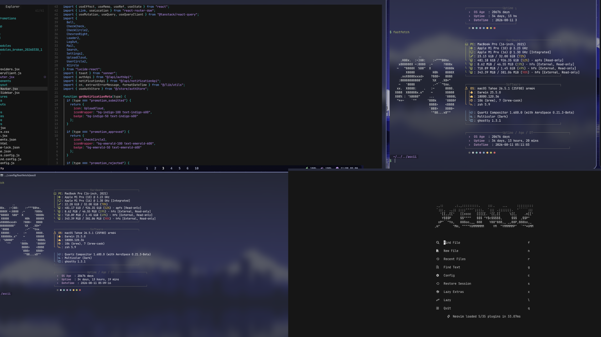

# ✦ XENOZ
<p align="center">
  
</p>
<p align="center">
  <strong>A minimal, keyboard-driven macOS rice.</strong>
</p>

<p align="center">
  AeroSpace · SketchyBar · JankyBorders · Ghostty · Neovim · Fastfetch
</p>

<p align="center">
  <code></code> · <code>󰆍</code> · <code>󰖯</code> · <code></code> · <code>󰙯</code>
</p>

---

## ✦ The Setup

**XENOZ** is my personal macOS environment built around a fast, minimal, and highly customizable workflow.

Inspired by **Hyprland**, **Catppuccin**, and modern Unix ricing.

| Component         | Tool                              |
| ----------------- | --------------------------------- |
| 🪟 Window Manager | **AeroSpace**                     |
| 📊 Status Bar     | **SketchyBar**                    |
| ◈ Window Borders  | **JankyBorders**                  |
| Terminal          | **Ghostty**                       |
| Editor            | **Neovim**                        |
| System Info       | **Fastfetch**                     |
| Shell             | **Zsh**                           |
| Font              | **JetBrainsMono Nerd Font**       |
| Theme             | **Dynamic / Catppuccin-inspired** |

---

## ✦ XENOZ Aesthetic

The goal is simple:

> **minimal · clean · keyboard-driven · slightly over-engineered**

XENOZ uses a dark translucent interface with:

* Rounded UI elements
* Glass / blur effects
* Dynamic wallpaper colors
* Floating workspaces
* Subtle purple accents
* Keyboard-first navigation
* A clean developer-focused workflow

### Color Palette

```text
Lavender   #b4befe
Mauve      #cba6f7
Pink       #f5c2e7
Blue       #89b4fa
Green      #a6e3a1
Surface    #313244
Base       #1e1e2e
```

---

## ✦ Architecture

```text
                         ┌──────────────┐
                         │  Wallpaper   │
                         └──────┬───────┘
                                │
                                ▼
                       ┌─────────────────┐
                       │  Dynamic Theme  │
                       └────────┬────────┘
                                │
                  ┌─────────────┴─────────────┐
                  │                           │
                  ▼                           ▼
          ┌─────────────┐             ┌─────────────┐
          │ SketchyBar  │             │JankyBorders │
          └──────┬──────┘             └──────┬──────┘
                 │                           │
                 └────────────┬──────────────┘
                              │
                              ▼
                       ┌─────────────┐
                       │  AeroSpace  │
                       └──────┬──────┘
                              │
                              ▼
                       Window Layout
```

---

## ✦ AeroSpace

A keyboard-driven tiling window manager for macOS.

### Workspaces

```text
⌥1  →  Web
⌥2  →  Code
⌥3  →  Media
⌥4  →  Editing
⌥5  →  Gaming
⌥6  →  Work
⌥7  →  7
⌥8  →  8
⌥9  →  9
```

### Window Navigation

```text
⌥ H    Focus left
⌥ J    Focus down
⌥ K    Focus up
⌥ L    Focus right
```

### Move Windows

```text
⌥⇧ H    Move left
⌥⇧ J    Move down
⌥⇧ K    Move up
⌥⇧ L    Move right
```

### Layout

```text
⌥ /    Toggle horizontal / vertical
⌥ ,    Toggle accordion
```

---

## ✦ SketchyBar

A floating and translucent status bar designed to work directly with AeroSpace.

Features:

* AeroSpace workspaces
* Current application
* Volume
* Battery
* Clock
* Rounded workspace pills
* Blur / glass effect
* Dynamic wallpaper colors
* Wallpaper-based theming

```text
sketchybar/
├── sketchybarrc
├── plugins/
└── theme/
    └── wallpaper_theme.sh
```

The workspaces sit in the center of the bar for a clean floating layout.

---

## ✦ JankyBorders

Focused windows receive a subtle dynamic border.

```text
╭──────────────────────────────╮
│                              │
│        Focused Window        │
│                              │
╰──────────────────────────────╯
```

The border color can follow the current wallpaper accent.

---

## ✦ Ghostty

My terminal of choice.

Designed around:

```text
JetBrainsMono Nerd Font
GPU acceleration
Minimal UI
Dark aesthetic
Fast startup
```

---

## ✦ Neovim

My development environment lives inside Neovim.

```text
nvim/
├── init.lua
└── lua/
    ├── ...
    └── ...
```

The configuration focuses on:

```text
LSP
Git
Treesitter
Telescope
Autocomplete
Syntax highlighting
Terminal workflow
```

---

## ✦ Fastfetch

A minimal system information display for the terminal.

```text
╭──────────────────────────────────────╮
│                                      │
│     XENOZ                           │
│   ├─ AeroSpace                       │
│   ├─ SketchyBar                      │
│   ├─ Ghostty                         │
│   └─ Neovim                          │
│                                      │
╰──────────────────────────────────────╯
```

---

## ✦ Wallpaper System

XENOZ uses wallpapers as part of the visual system rather than treating them as a separate background.

```text
Wallpaper
    │
    ▼
Color extraction
    │
    ▼
Dynamic theme
    │
    ├── SketchyBar
    └── JankyBorders
```

This allows the interface to adapt to different wallpapers while keeping the overall XENOZ aesthetic.

---

## ✦ Repository

```text
Dot-Files/
│
├── aerospace/
│   └── aerospace.toml
│
├── borders/
│   └── bordersrc
│
├── sketchybar/
│   ├── sketchybarrc
│   ├── plugins/
│   └── theme/
│
├── ghostty/
│   └── config
│
├── fastfetch/
│   └── config.jsonc
│
├── nvim/
│   ├── init.lua
│   └── lua/
│
└── wallpapers/
```

---

## ✦ Installation

Clone the repository:

```bash
git clone git@github.com:Rayaneaar/Dot-Files.git
cd Dot-Files
```

Install the required tools:

```bash
brew install --cask nikitabobko/tap/aerospace
brew install sketchybar
brew install borders
brew install --cask font-jetbrains-mono-nerd-font
brew install ghostty
brew install neovim
brew install fastfetch
```

### Link Configurations

```bash
ln -s ~/Dot-Files/sketchybar ~/.config/sketchybar
ln -s ~/Dot-Files/ghostty ~/.config/ghostty
ln -s ~/Dot-Files/fastfetch ~/.config/fastfetch
ln -s ~/Dot-Files/nvim ~/.config/nvim
```

For AeroSpace:

```bash
ln -s ~/Dot-Files/aerospace/aerospace.toml ~/.aerospace.toml
```

For JankyBorders:

```bash
ln -s ~/Dot-Files/borders/bordersrc ~/.config/bordersrc
```

---

## ✦ Philosophy

XENOZ isn't trying to be the most practical configuration.

It's about creating an environment that makes you **want to open the terminal and code.**

```text
             minimal
                +
            keyboard
                +
             tiling
                +
              blur
                +
            dynamic
                +
            beautiful
                │
                ▼
             XENOZ
```

---

<p align="center">

### ✦ XENOZ aka @Rayaneaar

**Made with  +

`⌘` `⌥` `⇧` `⌃`

</p>

